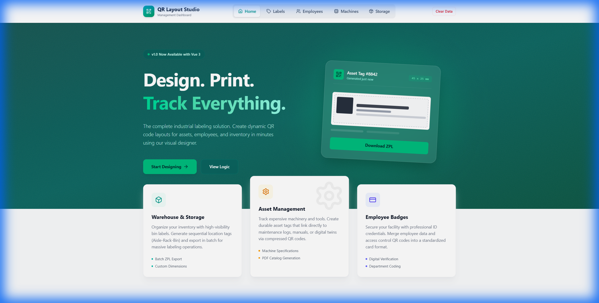
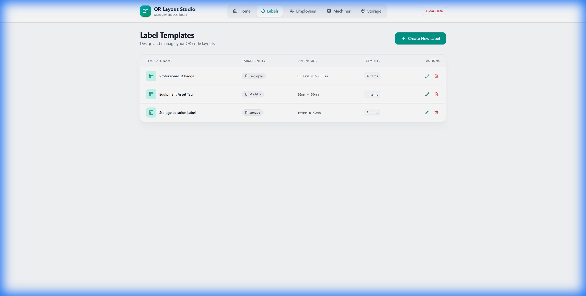
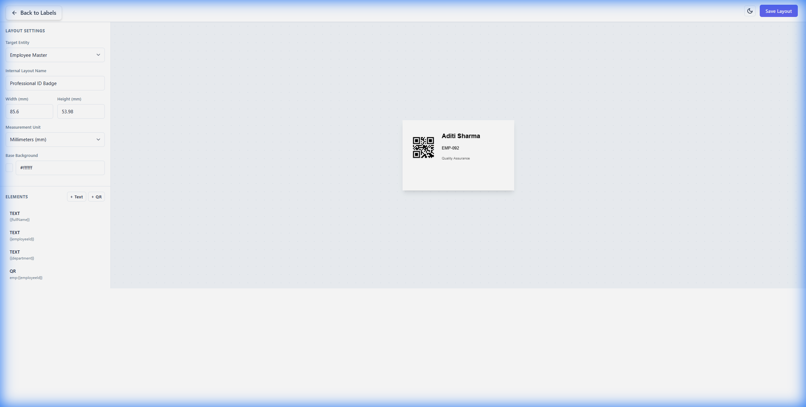
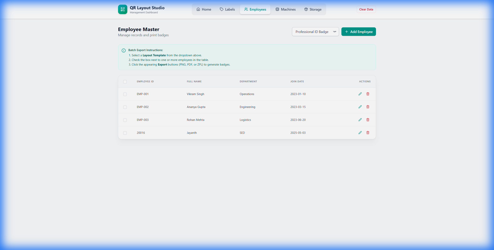
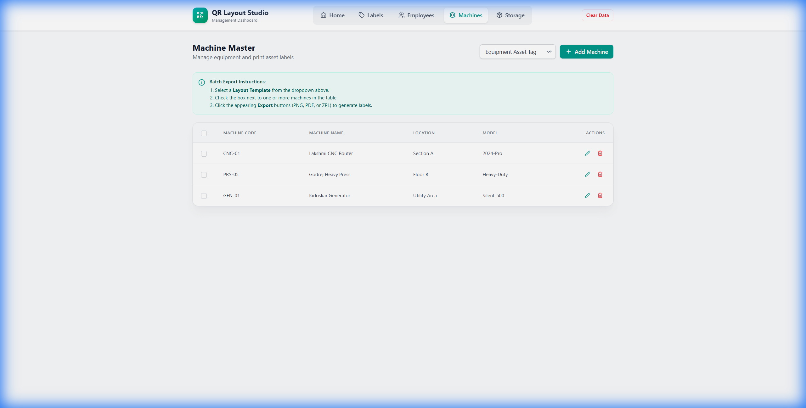
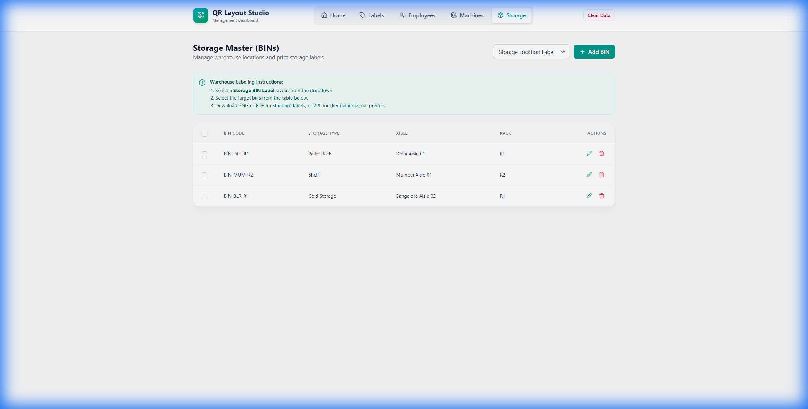

# QR Layout Studio

**QR Layout Studio** is a professional management dashboard designed to streamline the creation, organization, and printing of QR code-based labels for industrial and specialized environments. It serves as a centralized hub for managing Employees, Asset Machines, and Storage Locations, bridging the gap between digital data and physical labeling.



## What is it?

This tool is a specialized **Label Management System**. Unlike generic QR generators, QR Layout Studio is entity-aware. It understands that an "Employee" label needs names and IDs, while a "Machine" label needs model numbers and service dates. It provides a visual interface to design these templates and a management capability to organize the data that populates them.

## Key Features

-   **Visual Label Designer**: A drag-and-drop interface to create pixel-perfect label templates.
-   **Dynamic Data Binding**: Link visual elements to data fields (e.g., `{{fullName}}`, `{{assetID}}`).
-   **Batch Generation**: Select 100 employees and print 100 unique ID badges in one click (PDF, PNG, or ZPL).
-   **Entity Modules**: Dedicated workflows for:
    -   **Employees**: ID badges and access cards.
    -   **Machines**: Asset tags and equipment plates.
    -   **Storage**: Bin labels and rack location tags.
-   **ZPL Support**: Native support for Industrial Thermal Printers (Zebra Programming Language).

## Application Walkthrough

### 1. The Dashboard
Your central command center. Quickly access different modules or jump straight into designing a new layout.


### 2. Label Templates
Manage your collection of label designs. Create specific templates for different purposes (e.g., "Small Asset Tag", "Large Warehouse Bin Label").


### 3. Visual Designer
The core of the application. Customize dimensions, add text, QR codes, and images. Drag elements to position them precisely where they need to be.


### 4. Employee Management
Maintain your staff directory. Add new hires and instantly generate their ID badges using your pre-designed templates.


### 5. Machine Assets
Track your heavy machinery and tools. Generate durable asset tags that link to maintenance logs or digital twins.


### 6. Storage & Warehouse
Organize your inventory locations. Generate sequential logic for aisles, racks, and bins to ensure every storage spot is labeled.


## Example Usage: Onboarding a New Employee

Here is a typical workflow for issuing a new ID badge:

1.  **Create Template**: Go to **Labels** and design a "Standard ID Badge" (85mm x 54mm). Add `{{Name}}` and `{{EmployeeID}}` fields.
2.  **Add Data**: Navigate to **Employees** and click **"Add Employee"**. Enter "Jane Doe" and ID "EMP-2024".
3.  **Select & Print**:
    -   Locate Jane Doe in the list.
    -   Select the "Standard ID Badge" template from the dropdown.
    -   Click **Export PDF**.
4.  **Result**: A print-ready PDF of Jane's ID card is generated instantly.

---

## Installation & Setup

### Prerequisites
-   Node.js (Latest LTS)
-   npm

### Quick Start

1.  **Install dependencies**
    ```bash
    npm install
    ```

2.  **Start the dev server**
    ```bash
    npm run dev
    ```

3.  **Build for production**
    ```bash
    npm run build
    ```

## Folder Structure

```
vue-demo/
├── src/
│   ├── components/        # Reusable UI elements
│   ├── views/             # Page layouts (Home, Designer, Employees, etc.)
│   ├── services/          # Data logic and storage handling
│   └── assets/            # Static resources
├── docs/
│   └── images/            # Screenshots for this README
├── public/                # Public assets
└── index.html             # Entry point
```

## Technologies

-   **Vue 3** & **TypeScript**: Robust and type-safe frontend.
-   **Vite**: Lightning-fast tooling.
-   **Tailwind CSS**: Modern utility-first styling.
-   **Pinia/Storage**: efficient state management.
